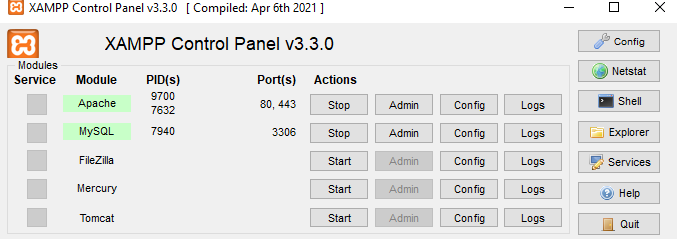
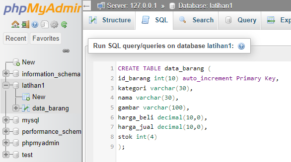
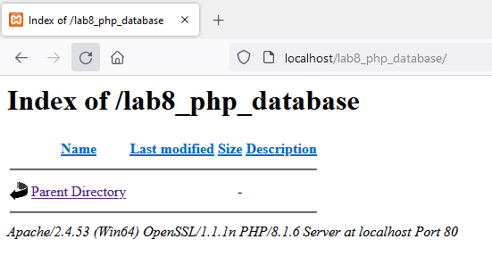
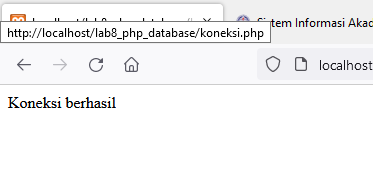
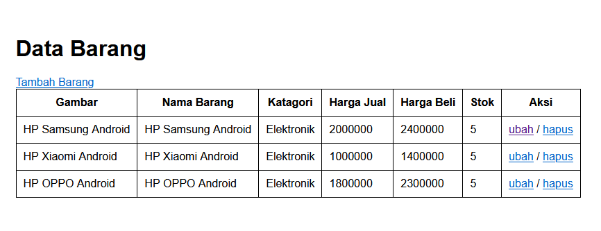

# Lab8Web

|  Nama     |  Fikri abei  |
|-----------|--------------|
|  Nim      |  312010417   |
|  Kelas    |  TI.20.A.1   |
|  Matkul   |  Pemograman web |

## PHP dan Database MySQL

## Langkah-Langkah Pratikum

Persiapan
Untuk memulai membuat aplikasi CRUD sederhana, yang perlu disiapkan adalah
database server menggunakan MySQL. Pastikan MySQL Server sudah dapat dijalankan
melalui XAMPP.

## garis MySQL

untuk menjalankan mysql server dari menu XAMPP control.



## Mengakses MySQL Cilent Menggunakan PHHP MyAdmin

Pastikan webserver Apache dan MySQL server sudah dijalankan. Kemudian buka
melalui browser: http://localhost/phpmyadmin/

## Membuat Database: Studi Kasus Data Barang

## Membuat Database
```CREATE DATABASE latihan1;```
## Membuat Tabel
```PHP 
CREATE TABLE data_barang (
id_barang int(10) auto_increment Primary Key,
kategori varchar(30),
nama varchar(30),
gambar varchar(100),
harga_beli decimal(10,0),
harga_jual decimal(10,0),
stok int(4)
);
```

## Menambahkan Data
```php
INSERT INTO data_barang (kategori, nama, gambar, harga_beli, harga_jual, stok)
VALUES ('Elektronik', 'HP Samsung Android', 'hp_samsung.jpg', 2000000, 2400000, 5),
('Elektronik', 'HP Xiaomi Android', 'hp_xiaomi.jpg', 1000000, 1400000, 5),
('Elektronik', 'HP OPPO Android', 'hp_oppo.jpg', 1800000, 2300000, 5);
```
![]

## Membuat Perogram CRUD

Buat folder lab8_php_database pada root directory web server (d:\xampp\htdocs)


Kemudian untuk mengakses direktory tersebut pada web server dengan mengakses URL:
http://localhost/lab8_php_database/


## Membuat File Koneksi Database
Buat File Koneksi.php
```php
<?php
$host = "localhost";
$user = "root";
$pass = "";
$db = "latihan1";
$conn = mysqli_connect($host, $user, $pass, $db);
if ($conn == false)
{
echo "Koneksi ke server gagal.";
die();
} #else echo "Koneksi berhasil";
?>
```
Buka melalui browser untuk menguji koneksi database (untuk menyampilkan pesan
koneksi berhasil, uncomment pada perintah echo “koneksi berhasil”;

## Membuat File Index Untuk Data (Read)
Buat file baru dengan nama index.php
```php
<?php
include("koneksi.php");
// query untuk menampilkan data
$sql = 'SELECT * FROM data_barang';
$result = mysqli_query($conn, $sql);
?>
<!DOCTYPE html>
<html lang="en">
<head>
<meta charset="UTF-8">
<link href="style.css" rel="stylesheet" type="text/css" />
<title>Data Barang</title>
</head>
<body>
<div class="container">
<h1>Data Barang</h1>
<div class="main">
<table>
<tr>
<th>Gambar</th>
<th>Nama Barang</th>
<th>Katagori</th>
<th>Harga Jual</th>
<th>Harga Beli</th>
<th>Stok</th>
<th>Aksi</th>
</tr>
<?php if($result): ?>
<?php while($row = mysqli_fetch_array($result)): ?>
<tr>
<td>" alt="<?=
$row['nama'];?>"></td>
<td><?= $row['nama'];?></td>
<td><?= $row['kategori'];?></td>
<td><?= $row['harga_beli'];?></td>
<td><?= $row['harga_jual'];?></td>
<td><?= $row['stok'];?></td>
<td><?= $row['id_barang'];?></td>
</tr>
<?php endwhile; else: ?>
<tr>
<td colspan="7">Belum ada data</td>
</tr>
<?php endif; ?>
</table>
</div>
</div>
</body>
</html>
```


## Menambahkan data (Buat)
Buat file baru dengan nama tambah.php
```php
<?php
error_reporting(E_ALL);
include_once 'koneksi.php';
if (isset($_POST['submit']))
{
$nama = $_POST['nama'];
$kategori = $_POST['kategori'];
$harga_jual = $_POST['harga_jual'];
$harga_beli = $_POST['harga_beli'];
$stok = $_POST['stok'];
$file_gambar = $_FILES['file_gambar'];
$gambar = null;
if ($file_gambar['error'] == 0)
{
$filename = str_replace(' ', '_',$file_gambar['name']);
$destination = dirname(__FILE__) .'/gambar/' . $filename;
if(move_uploaded_file($file_gambar['tmp_name'], $destination))
{
$gambar = 'gambar/' . $filename;;
}
}
$sql = 'INSERT INTO data_barang (nama, kategori,harga_jual, harga_beli,
stok, gambar) ';
$sql .= "VALUE ('{$nama}', '{$kategori}','{$harga_jual}',
'{$harga_beli}', '{$stok}', '{$gambar}')";
$result = mysqli_query($conn, $sql);
header('location: index.php');
}
```
```php
?>
<!DOCTYPE html>
<html lang="en">
<head>
<meta charset="UTF-8">
<link href="style.css" rel="stylesheet" type="text/css" />
<title>Tambah Barang</title>
</head>
<body>
<div class="container">
<h1>Tambah Barang</h1>
<div class="main">
<form method="post" action="tambah.php"
enctype="multipart/form-data">
<div class="input">
<label>Nama Barang</label>
<input type="text" name="nama" />
</div>
<div class="input">
<label>Kategori</label>
<select name="kategori">
<option value="Komputer">Komputer</option>
<option value="Elektronik">Elektronik</option>
<option value="Hand Phone">Hand Phone</option>
</select>
</div>
<div class="input">
<label>Harga Jual</label>
<input type="text" name="harga_jual" />
</div>
<div class="input">
<label>Harga Beli</label>
<input type="text" name="harga_beli" />
</div>
<div class="input">
<label>Stok</label>
<input type="text" name="stok" />
</div>
<div class="input">
<label>File Gambar</label>
<input type="file" name="file_gambar" />
</div>
<div class="submit">
<input type="submit" name="submit" value="Simpan" />
</div>
</form>
</div>
</div>
</body>
</html>
```
## Sebelum di tambah

## Menghapus Data (Hapus)

buat file baru dengan nama hapus.php
```php
$sql = 'UPDATE data_barang SET ';
$sql .= "nama = '{$nama}', kategori = '{$kategori}', ";
$sql .= "harga_jual = '{$harga_jual}', harga_beli = '{$harga_beli}', stok
= '{$stok}' ";
```

